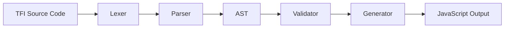

# TFI Language Compiler - Documentation

## Overview

The TFI (Telugu Film Industry) language compiler is a learning project that demonstrates how to build a complete compiler from scratch. It takes TFI source code and compiles it to JavaScript. The compiler consists of several key components that work together in a pipeline.

## Compiler Architecture



## Component Documentation

### 1. [Lexer (Tokenization)](lexer/README.md)
The lexer breaks down source code into individual tokens. It recognizes keywords, identifiers, numbers, operators, and other language elements.

**Key Features:**
- Uses Telugu movie names as keywords (`rrr`, `pushpa`, `bahubali`, etc.)
- Efficient tokenization with `logos` crate
- Whitespace skipping and error recovery
- Extensible design for new tokens

### 2. [Parser (Syntax Analysis)](parser/README.md)
The parser takes tokens from the lexer and builds an Abstract Syntax Tree (AST). It ensures the code follows the language's grammar rules.

**Key Features:**
- Declarative grammar using `pest` parser generator
- Detailed error messages with line/column information
- Operator precedence handling
- Extensible for new language constructs

### 3. [AST (Abstract Syntax Tree)](ast/README.md)
The AST is a tree representation of the source code's structure. It abstracts away syntax details and focuses on the logical structure.

**Key Features:**
- Language-agnostic representation
- Type-safe Rust enums
- Easy to analyze and transform
- Clear debugging support

### 4. [Validator (Semantic Analysis)](validator/README.md)
The validator performs semantic analysis to ensure the program is logically correct. It checks for issues that can't be caught by syntax analysis alone.

**Key Features:**
- Variable scoping and shadowing rules
- Semantic constraint checking
- Detailed error messages with suggestions
- Scope-aware validation

### 5. [Generator (Code Generation)](generator/README.md)
The generator takes the validated AST and produces JavaScript code. It traverses the tree and converts each node to equivalent JavaScript.

**Key Features:**
- Clean, readable JavaScript output
- Proper formatting and indentation
- Expression precedence preservation
- Control flow generation

### 6. [Compiler (Orchestration)](compiler/README.md)
The compiler is the main orchestrator that coordinates all other components. It manages the compilation pipeline and provides a unified interface.

**Key Features:**
- Unified compilation interface
- Comprehensive error handling
- Compilation options and statistics
- Performance optimization

### 7. [Grammar Definition](grammar/README.md)
The grammar file defines the syntax rules for the TFI language using Pest's declarative grammar format.

**Key Features:**
- Declarative syntax rules
- Repetition and alternative patterns
- Atomic and silent rules
- Extensible grammar design

## Quick Start

### Basic Compilation

```rust
use tfi_lang::compile;

let source = r#"
    bahubali("Hello, TFI!");
    rrr x = 42;
    bahubali("The answer is", x);
"#;

match compile(source) {
    Ok(js_code) => println!("Generated JavaScript:\n{}", js_code),
    Err(e) => eprintln!("Compilation error: {}", e),
}
```

### TFI Language Examples

#### Simple Program
```tfi
bahubali("Hello, world!");
rrr x = 10;
pushpa y = 5;
bahubali("Sum:", x + y);
```

#### Control Structures
```tfi
rrr x = 15;

magadheera(x > 10) {
    bahubali("x is greater than 10");
} karthikeya {
    bahubali("x is 10 or less");
}

pokiri(x > 0) {
    bahubali(x);
    pushpa x = x - 1;
}
```

#### For Loop
```tfi
eega(rrr i = 0; i < 5; i + 1) {
    bahubali("Count:", i);
}
```

## Language Features

### Keywords (Telugu Movie Names)

| TFI Keyword | Purpose | JavaScript Equivalent |
|-------------|---------|----------------------|
| `rrr` | Const declaration | `const` |
| `pushpa` | Let declaration | `let` |
| `bahubali` | Print statement | `console.log` |
| `magadheera` | If statement | `if` |
| `karthikeya` | Else statement | `else` |
| `pokiri` | While loop | `while` |
| `eega` | For loop | `for` |

### Data Types

- **Numbers**: Integer literals (`42`, `100`, `0`)
- **Strings**: Text literals (`"Hello"`, `"World"`)
- **Identifiers**: Variable names (`x`, `y`, `counter`)

### Operators

- **Arithmetic**: `+`, `-`, `*`, `/`
- **Comparison**: `>`, `<`, `>=`, `<=`, `==`, `!=`

### Control Structures

- **If-else**: `magadheera(condition) { ... } karthikeya { ... }`
- **While**: `pokiri(condition) { ... }`
- **For**: `eega(init; condition; update) { ... }`

## Learning Benefits

This compiler demonstrates several important concepts:

1. **Lexical Analysis**: How to break source code into tokens
2. **Parsing**: How to build structured representations from tokens
3. **Semantic Analysis**: How to validate program logic
4. **Code Generation**: How to produce target code from AST
5. **Error Handling**: How to provide helpful error messages
6. **Modular Design**: How to separate concerns in a compiler

## Project Structure

```
tfi-lang/
├── src/
│   ├── lexer.rs      # Tokenization
│   ├── parser.rs     # Syntax analysis
│   ├── ast.rs        # Abstract syntax tree
│   ├── validator.rs  # Semantic analysis
│   ├── generator.rs  # Code generation
│   ├── compiler.rs   # Orchestration
│   └── lib.rs        # Public interface
├── grammar.pest      # Grammar definition
├── docs/             # Component documentation
│   ├── lexer/
│   ├── parser/
│   ├── ast/
│   ├── validator/
│   ├── generator/
│   ├── compiler/
│   └── grammar/
└── tests/            # Test suite
```

## Getting Started

### Prerequisites

- Rust 1.70 or later
- Cargo package manager

### Installation

```bash
git clone <repository-url>
cd tfi-lang
cargo build
```

### Running Tests

```bash
cargo test
```

### Running Examples

```bash
# Compile a TFI file
cargo run -- main.tfi

# Or use the library directly
cargo run --example basic
```

## Contributing

This is a learning project, but contributions are welcome! Areas for improvement:

1. **Language Features**: Add new constructs (functions, arrays, etc.)
2. **Error Handling**: Improve error messages and recovery
3. **Performance**: Optimize compilation speed
4. **Documentation**: Enhance examples and explanations
5. **Testing**: Add more test cases

## License

This project is open source and available under the MIT License.

## Acknowledgments

- **Pest**: For the excellent parser generator
- **Logos**: For fast and efficient lexing
- **Telugu Film Industry**: For the creative keyword inspiration

---

**Happy Compiling! 🚀**

The TFI language's use of Telugu movie names as keywords makes it memorable and fun while teaching fundamental compiler construction principles. 